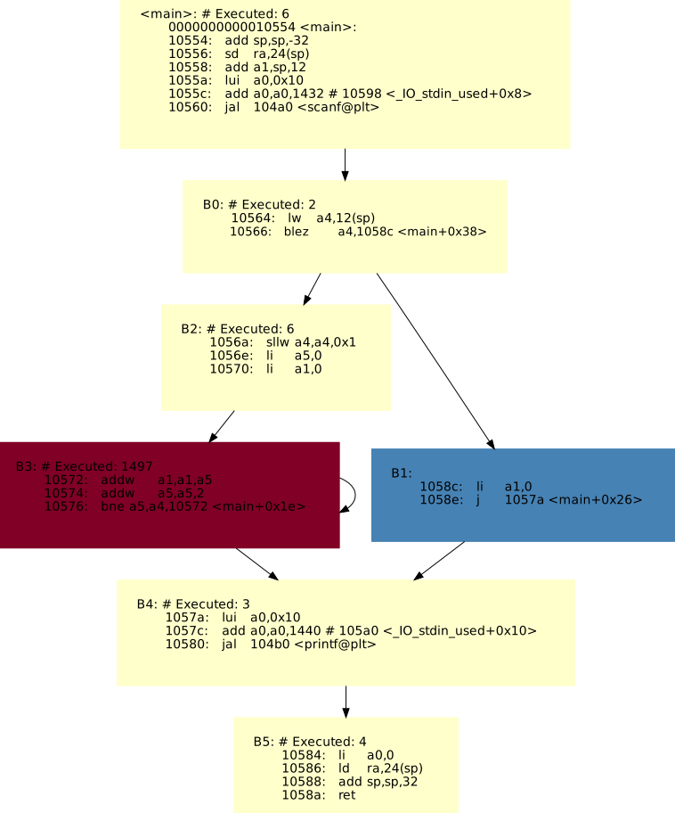

# ASMGraph

## Overview

&nbsp;&nbsp;&nbsp;&nbsp;ASMGraph is a simple framework which tends to help compiler developers who work on RISC-V architecture. \
This framework intends to:

* Visualize functions' assembly code through dot graphs
* Highlight executed and the hottest BBs in each function
* Extract singleton BBs from the whole function
* Find several instruction fusion cases like:
    * Extending (SI->DI, HI->DI)
    * Integer indexed loads
    * Load with preincrement
    * Load from constant addresses
    * Address and constant formation
    * Double address and constant formation
* Compute executed instructions count like `llvm-mca`

&nbsp;&nbsp;&nbsp;&nbsp;The instrument can be easily integrated to CI/CD systems to evaluate changes that you made.

**Note**: To harness the full power of the instrument, you need the Qemu bbexec plugin.

---

## Requirements

&nbsp;&nbsp;&nbsp;&nbsp;To use instrument you need to have

* **python3**
* **pip3**
* **dot**
* **libgirepository1.0-dev** (only for GUI)
* **libcairo2-dev** (only for GUI)
* **gir1.2-webkit-4.0** (only for GUI)

&nbsp;&nbsp;&nbsp;&nbsp;Suggested command line to install them

```commandline
sudo apt-get install python3 python3-pip xdot libgirepository1.0-dev libcairo2-dev gir1.2-webkit-4.0
```

&nbsp;&nbsp;&nbsp;&nbsp;The tool also requires some python libraries that can be found in **requirements.txt.**
They can be easily installed by the following command:

``` commandline
pip3 install -r requirements.txt
```

**Note: Some of the modules may require additional tools such as `cmake` and `pkg-config`**

---

## Usage

&nbsp;&nbsp;&nbsp;&nbsp;`asm_graph.py` is the main script of the framework. It handles the core functionality of processing binary and assembly files, generating dot graphs, and performing various checks.

```commandline
asm_graph.py (-a ASM | -b BIN -d OBJDUMP | --add_plugin PLUGIN_NAME PLUGIN_PATH) [OPTIONS]
```

### asm_graph.py options:

* `-h, --help`        Show this help message and exit
* `-a ASM, --asm ASM` Path to assembly file.
* `-b BIN, --bin BIN` Path to the binary file.
* `-d OBJDUMP, --objdump OBJDUMP` Path to the disassembler (riscv-objdump).
* `-f FUNC, --func FUNC` The name of the function that should be extracted. By default, will produce all functions from the text segment.
* `-c BBEXEC, --bbexec BBEXEC` Path to the bbexec file.
* `--dot`                Create dot graphs for functions.
* `--min_exec_count MIN_EXEC_COUNT` Minimum number of times BB must be executed to process it with plugins.
* `-s, --singletons`    Collect singleton basic blocks into the singletons.xlsx.
* `-o OUTPUT, --output OUTPUT`
 The name of the out directory. (by default: `cwd`/output)
* `--run_plugins` Run the enabled plugins from plugins/plugins.json
* `--add_plugin PLUGIN_NAME PLUGIN_PATH`
                        Add a custom plugin. Provide plugin name and file path.
                        File must contain a 'run' function with a 'Node' object as input (see plugins/example.py).

### Usage examples:

&nbsp;&nbsp;&nbsp;&nbsp;ASMGraph can be used in two modes, with and without **bbexec** file.
Providing **bbexec** file opens several opportunities like highlighting the hottest BBs
or computing instructions group like `llvm-mca`.

&nbsp;&nbsp;&nbsp;&nbsp;To run ASMGraph, you must specify either the assembly file or the binary and the disassembler path.

**NOTE: If you disassemble yourself you must pass `--no-show-raw-insn` option to disassembler**

---

1. Here is an example to run ASMGraph through binary.

```commandline
./asm_graph.py -b ./path/to/test.exe --objdump /full/path/to/riscv-**objdump -o output
```

&nbsp;&nbsp;&nbsp;&nbsp;In this case, the output directory will contain all function bodies extracted in separate files.

---

2. To run ASMGraph through your disassembled file, run the following command.

```commandline
./asm_graph.py -a ./path/to/test.asm -o output
```

---

3. In order to visualize `my_function` run the following command.

```commandline
./asm_graph.py -a ./path/to/test.asm -f my_function --dot -o output
```

&nbsp;&nbsp;&nbsp;&nbsp;After this, the output directory will contain my_function.asm and my_function.dot files for function body and visualization files, respectively.

&nbsp;&nbsp;&nbsp;&nbsp;Unfortunately, this option may slow down execution performance.
We set a time limit for each function in 10 minutes.

**NOTE: If working on a function takes longer than the time limit, the function is added to the blacklist that is stored in `functions_blacklist.json`**

---

4. To apply execution info in visualization, you must also add `-c` option.

```commandline
./asm_graph.py -a ./path/to/test.asm -c ./path/to/test.bbexec -f my_function --dot -o output
```

&nbsp;&nbsp;&nbsp;&nbsp;BBs that did not execute at all will be colored in blue, and the most executed ones in dark red

---

5. To run plugins you need to run the following command. Don't forget enable the necessary plugins in the `plugins/plugins.json`

```commandline
./asm_graph.py -a ./path/to/test.asm --run_plugins -o output
```

&nbsp;&nbsp;&nbsp;&nbsp;After the execution, you can find the test.xlsx file in the output directory which contains the results of each plugin separated into responding sheets.

**SUGGESTION:**\
&nbsp;&nbsp;&nbsp;&nbsp;Run plugins with bbexec info to get only the actual and interesting cases.

```commandline
./asm_graph.py -a ./path/to/test.asm -c ./path/to/test.bbexec --run_plugins -o output
```

&nbsp;&nbsp;&nbsp;&nbsp;ASMGraph gets rid of each BB which has less than `1M` dynamic instruction. 
To adjust that value use the `--min_exec_count` option. For example, to check only BBs that have at least 5M execution use this command line.

```commandline
./asm_graph.py -a ./path/to/test.asm -c ./path/to/test.bbexec --run_plugins --min_exec_count 5000000 -o output
```

---

6. In order to extract singleton BBs run the following command.

```commandline
./asm_graph.py -a ./path/to/test.asm -s -o output
```

# Real example

&nbsp;&nbsp;&nbsp;&nbsp;Suppose we have the following code

```C
int main() {
  int n, sum = 0;
  scanf ("%d", &n);
  for (int i = 0; i < n; i++) {
     sum += i * 2;
  }

  printf("Sum is %d\n", sum);

  return 0;
}
```

&nbsp;&nbsp;&nbsp;&nbsp;Our goal is to understand / highlight which part of the code is the most executed fragment.
For that purpose we compile, run and pass some inputs to our target program.
After execution, we will get the Qemu bbexec file.
Next we need to pass the target binary and the bbexec file to ASMGraph with the following command line.

```commandline
./asm_graph.py -b ./path/to/binary -d /path/to/objdump -c ./path/to/target.bbexec -f main --dot -o output
```

&nbsp;&nbsp;&nbsp;&nbsp;After executing the instrument we can see the visualization like this one.



&nbsp;&nbsp;&nbsp;&nbsp;As we can see B3 is the most executed (hottest) basic block and B1 was not executed at all. \
The cost or dynamic instruction count of B3 is *1497*.

# What is `.bbexec` file?

&nbsp;&nbsp;&nbsp;&nbsp;The `.bbexec` file contain information about the execution of BBs. To obtain the `.bbexec` file, you must apply the `qemu.patch` patch to the QEMU's sources which add the required plugin, and then build it.

```commandline
sudo apt-get install build-essential libcairo2-dev libpango1.0-dev \
libjpeg-dev libgif-dev librsvg2-dev ninja-build
sudo apt install qemu-system-misc qemu-user-static binfmt-support
```

&nbsp;&nbsp;&nbsp;&nbsp;Next, apply the QEMU basic block execution plugin as a patch for the QEMU sources:

```commandline
cd riscv-gnu-toolchain/qemu
git apply /path/to/qemu.patch
```

&nbsp;&nbsp;&nbsp;&nbsp;The project is located in the `build` directory:

```commandline
./configure --prefix="$PWD/build" --enable-plugins
make
make plugins
```

&nbsp;&nbsp;&nbsp;&nbsp;After that, execute your binary file by QEMU with the follow steps:
1. Navigate to the qemu directory.
2. Run the command: `find . -iname “libbbexec.so”`
3. Set the QEMU_PLUGIN environment variable to the path of `libbbexec.so`:\
&nbsp;&nbsp;&nbsp;&nbsp;`export QEMU_PLUGIN="file=lib_bbexec_path"`
5. Finally, execute your binary file using the appropriate QEMU architecture.


# How to evaluate changes?

&nbsp;&nbsp;&nbsp;&nbsp;We provide a script that will help you with that issue.
`evaluate_versions.py` script intends to compare the performance of two compilers.

&nbsp;&nbsp;&nbsp;&nbsp;For example, you have *bbexec files gathered in `dir_1` and `dir_2` directories,
respectively for C1 and C2 compilers. To compare them just run the following command line.

```commandline
./evaluate_versions.py --fd ./dir_1 --sd ./dir_2 --all
```

&nbsp;&nbsp;&nbsp;&nbsp;To compare individual .bbexec files use this command line:

```commandline
./evaluate_versions.py --ff ./bbexec_file_1 --sf ./bbexec_file_2
```

&nbsp;&nbsp;&nbsp;&nbsp;In the current working directory will be created the `evaluation_result.xlsx` sheet that contains the comparison of each `*bbexec` file separated sheet by sheet.
The names of `*bbexec` files are important, the script tries to compare only files with the same name.

&nbsp;&nbsp;&nbsp;&nbsp;Additionally, it provides a general comparison sheet (*general_diff*) to show the overall differences.
If you wish to see only the general comparison sheet, then just skip the `--all` option.

## Plugin System Usage

&nbsp;&nbsp;&nbsp;&nbsp;The project supports a flexible plugin system that allows users to run custom and built-in plugins on the basic blocks of the assembly code. Each plugin provides a specific analysis or transformation, and you can easily add, enable, or disable plugins.

### Plugin Structure

&nbsp;&nbsp;&nbsp;&nbsp;Plugins are defined in a JSON structure, where each plugin has:

- __name:__ A human-readable name for the plugin.
- __enabled:__ A boolean indicating whether the plugin is active.
- __function:__ The path to the function that the plugin runs.
- __args:__ The arguments passed to the function.

### Adding a New Plugin

1. **Create Plugin File:** Add a new Python file.
2. **Define `run()` Function:** Each new plugin must define a run() function, which will be called by the system. The function should follow this signature:

```python
def run(basic_block: Node) -> List[dict]:
    # Your plugin logic here
    return []
```

3. **Add your new plugin** by using either the `--add_plugins` flag of the `asm_graph.py` or the **ASMGraph GUI**

&nbsp;&nbsp;&nbsp;&nbsp;Now, when the application runs, it will import your new plugin and execute it.

### Example Command

&nbsp;&nbsp;&nbsp;&nbsp;Enable necessary plugins in `plugins/plugin.json` and add `--run_plugins` flag when running `asm_graph.py`:

```commandline
./asm_graph.py --run_plugins ...
```

## ASMGraph GUI

&nbsp;&nbsp;&nbsp;&nbsp;Use the `asm_gui.py` script to open **ASMGraph GUI**.
The GUI provides an easy-to-use interface for visualizing and interacting with the different features of ASMGraph.

### Dot File Visualization
&nbsp;&nbsp;&nbsp;&nbsp;A key feature of the GUI is the capability to visualize dot files.

### Plugin Management
&nbsp;&nbsp;&nbsp;&nbsp;The ASMGraph GUI incorporates a plugin management system that enables users to execute plugins on the visualized data, \
with the results being stored in the xlsx file. Users can easily add new plugins through the GUI by providing a file with the plugin. \
The file must include a `run()` function from which the plugin execution begins. An example of a custom plugin can be found in the `plugins` directory.
